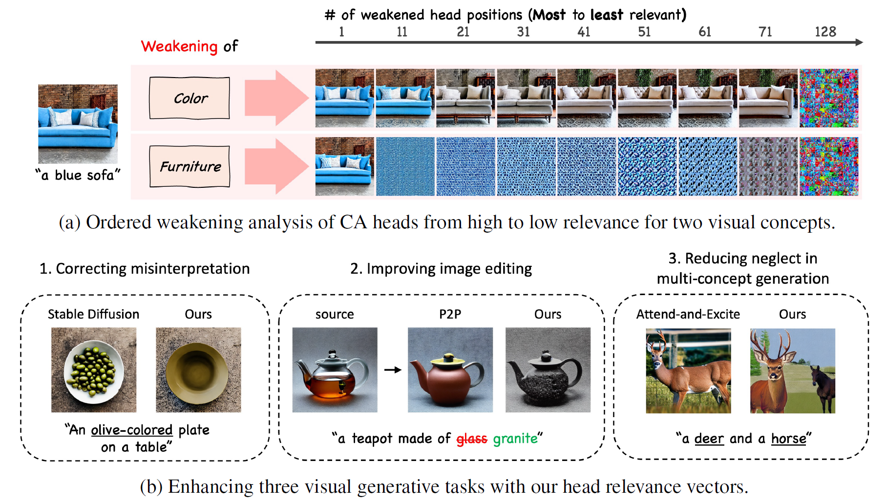
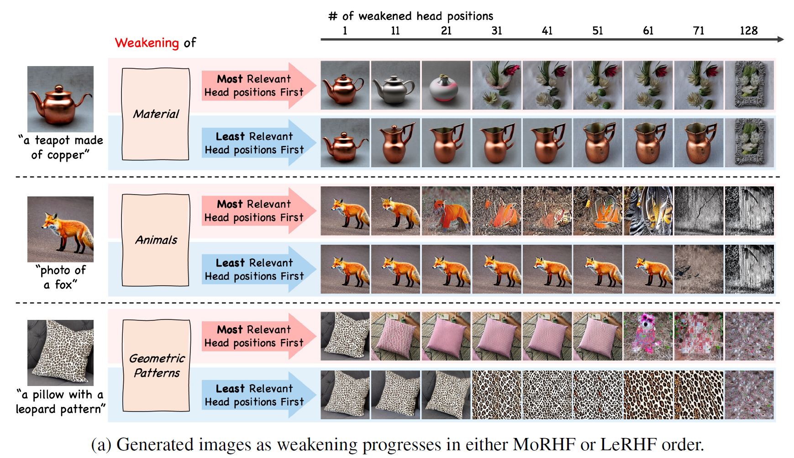
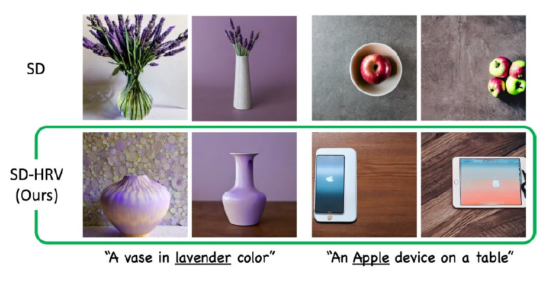
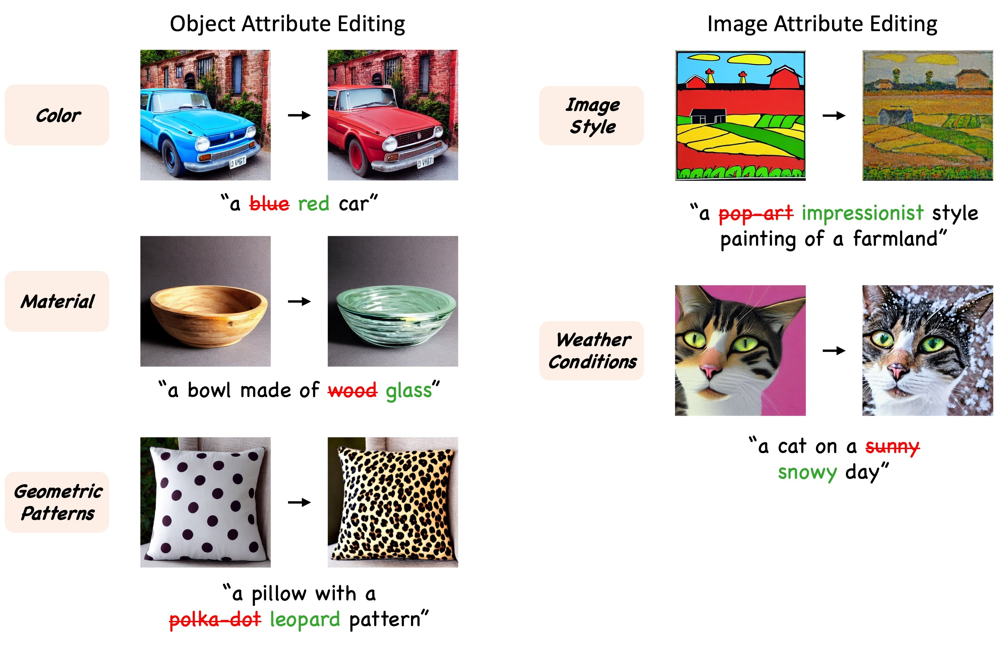
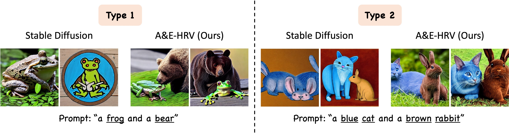

# Cross-Attention Head Position Patterns Can Align with Human Visual Concepts in Text-to-Image Generative Models


### [Paper Link](https://arxiv.org/abs/2412.02237)

## Setup

This code was tested with Python 3.12.2, [Pytorch](https://pytorch.org/) 2.2.1+cu121 using pre-trained models through [huggingface / diffusers](https://github.com/huggingface/diffusers#readme).
Specifically, we implemented our method over [Stable Diffusion v1.4](https://huggingface.co/CompVis/stable-diffusion-v1-4) or [Stable Diffusion XL](https://huggingface.co/stabilityai/stable-diffusion-xl-base-1.0).  
Currently, Stable Diffusion XL is implemented only for the Ordered Weakening Analysis and Reducing Misinterpretations. 

To construct the environment, run the following command:
``` python
conda env create -f environment.yaml
```

The code was tested on a RTX3090 24GB but should work on other cards with at least **9GB** VRAM with Stable Diffusion v1.4.
(Stable Diffusion XL requires at least **21GB** VRAM)

## Quickstart
1. Run the following command to activate environment:
   ``` python
   conda activate hrv-diffusion
   ```
2. **You can skip the following processes if you already have the CSV files under the `./final_result` folder. For convenience, we provide the CSV files for the head relevance vectors of SD v1.4 and SDXL with our concept-words set.** If you want to construct the head relevance vectors using your own concept-words, please follow steps 3 to 6.
3. Place your concept-words under the `./descriptions` folder. Currently, we provide `340_final_text_list.csv` as an example. You can use `./descriptions/description_extraction.ipynb` to generate a `.txt` file (e.g., `340_final_text_descriptions.txt`) from the CSV file. Both files are required to complete steps 4 through 6.
4. Embed your text descriptions into text embeddings with `descriptions_to_text_embeddings.py`, for instance
   ``` python
   python descriptions_to_text_embeddings.py --gpu_num 0 --description 340_final_text_descriptions --model_card "CompVis/stable-diffusion-v1-4"
   ```   
   for SDXL, change your model_card to `stabilityai/stable-diffusion-xl-base-1.0`

5. (Random image generation) Calculate head relevance vectors with
   `head_relevance_calculation.py`, for instance
   ``` python
   python head_relevance_calculation.py --gpu_num 0 --prompt merged --description 340_final_text_descriptions --epochs 1 --num_words_per_concept 10 --num_concepts 34
   ```
   for SDXL, use `head_relevance_calculation_sdxl.py` instead.

   When using multiple GPUs, use `--subset_running` flag to split the calculation into multiple GPUs. For instance
   ``` python
   python head_relevance_calculation.py --gpu_num 0 --prompt merged --description 340_final_text_descriptions --epochs 1 --num_words_per_concept 10 --num_concepts 34 --subset_running --numerator 1 --denominator 4   
   python head_relevance_calculation.py --gpu_num 1 --prompt merged --description 340_final_text_descriptions --epochs 1 --num_words_per_concept 10 --num_concepts 34 --subset_running --numerator 2 --denominator 4   
   python head_relevance_calculation.py --gpu_num 2 --prompt merged --description 340_final_text_descriptions --epochs 1 --num_words_per_concept 10 --num_concepts 34 --subset_running --numerator 3 --denominator 4   
   python head_relevance_calculation.py --gpu_num 3 --prompt merged --description 340_final_text_descriptions --epochs 1 --num_words_per_concept 10 --num_concepts 34 --subset_running --numerator 4 --denominator 4   
   ```
6. Finally, save head relevance vector for each concept with the jupyter notebook `extract_head_relevance_vectors.ipynb` 

## Ordered Weakening Analysis - head perturbation


top_k refers to MoRHF (Most Relevant Head positions First) order, and bottom_k refers to LeRHF (Least Relevant Head positions First) order.

1. Make shell script using `./ordered_weakening_analysis/hp_construct_prompts.ipynb`
2. Run the shell script saved in `./ordered_weakening_analysis/running_codes/hp_running_code.sh` to generate images with negatively rescaling heads in MoRHF and LeRHF orders
3. Calculate CLIP image-text similarity and save it as a csv file using `./ordered_weakening_analysis/hp_calculate_similarity.ipynb`
4. Use `./ordered_weakening_analysis/hp_draw_plots.ipynb` to draw the line plots
5. Use `./ordered_weakening_analysis/hp_draw_figures.ipynb` to see the generated images

**This analysis shows that our HRVs effectively identify cross-attention (CA) head orderings that align well with the relevance of the corresponding visual concepts.**

The following three applications demonstrate the effectiveness of HRV in various visual generative tasks.

## [Reducing Misinterpretation of polysemous words] SD-HRV: Stable Diffusion (SD) + Concept Adjusting


1. Refer to `./applications/reduce_misinterpretation.ipynb` for SD v1
2. Refer to `./applications/reduce_misinterpretation_sdxl.ipynb` for SDXL

## [Image Editing] P2P-HRV: P2P with Head Relevance Vectors; P2P + Concept Strengthening


### Python Script
1. Run `./applications/p2p_hrv.py`, for instance
   ``` python
   python ./applications/p2p_hrv.py --use_soft_vector --concepts "Color" --gpu_num 0 --prompts "a blue car" "a red car" --target_token "red" --seeds 20 --experiment_num 1 --cross_replace_steps 0.8 --self_replace_steps 0.9 --save_original_p2p --original_p2p_cross_replace_steps 0.8 --original_p2p_self_replace_steps 0.4
   ```
2. Using the `--use_soft_vector` flag saves images edited with P2P-HRV using head relevance vectors.
3. `--prompts (source prompt) (target prompt)` specifies the source and target prompts for image editing.
4. `--concepts` is used to specify the concept of the target token.
5. `--cross_replace_steps` and `--self_replace_steps` are used to control the attention replacement steps (from 0.0 to 1.0) in cross and self attention respectively. To minimize structure changes from source images, use higher values for `--self_replace_steps`.
6. `--target_token` is used to specify the token for applying concept strengthening.
7. `--experiment_num` is used to specify the experiment number for saving the results.
8. `--seeds` is used to specify the seeds for the image generation. Multiple seeds will generate multiple images for each prompt
9. Using the `--save_original_p2p` flag saves images edited with the original P2P images.
10. `--original_p2p_cross_replace_steps` and `--original_p2p_self_replace_steps` are used to control the attention replacement steps (from 0.0 to 1.0) in cross and self attention respectively, in the original P2P. To minimize structure changes from source images, use higher values for `--original_p2p_self_replace_steps`.

### Jupyter Notebook
1. Refer to `./applications/p2p_hrv.ipynb`.


## [Multi-concept generation] A&E-HRV: Attend-and-Excite with Head Relevance Vectors; A&E + Concept Strengthening


This code requires at least **22GB** VRAM. Attend-and-Excite (A&E) excites image features using averaged cross-attention maps. A&E-HRV extends this by using head relevance vectors to weight each cross-attention map before averaging. We apply A&E or A&E-HRV only to noun tokens, following the original Attend-and-Excite paper.

1. Run `./applications/attend_and_excite_hrv.py`, for instance 
   ``` python
   python ./applications/attend_and_excite_hrv.py --gpu_num 0 --prompt "A black cat and a white dog" --seeds 20 --token_indices 3 7 --smooth_attentions --concepts "Animals" "Animals"
   ```
2. `--token_indices` specifies the indices of the tokens in the prompt for which A&E/A&E-HRV are applied (e.g. indices of "cat" and "dog") (Please refer to `./applications/check_token_indices.ipynb` to find the indices of the tokens in the prompt.).
3. `--concepts` specifies the concepts of the tokens for which concept strengthening is applied (e.g. concepts of "cat" and "dog").
4. For standard Attend-and-Excite results, run `./applications/attend_and_excite_hrv.py` with
`--run_standard_attend_excite` flag
5. For naive Stable Diffusion results, run `./applications/attend_and_excite_hrv.py` with
`--run_standard_sd` flag

## HRV Visualization
1. Refer to `./applications/hrv_visualization.ipynb`

## Final note for future work
1. HRV effectively identifies a cross-attention (CA) head ordering that aligns well with the relevance of the corresponding visual concepts. However, HRV is currently normalized to have an L1 norm of H, which may cause some HRV vector elements to become too large when rescaling CA maps for Stable Diffusion XL (SDXL). For context, Stable Diffusion v1 has H=128 CA heads, while SDXL has H=1300 CA heads. One possible solution is to clamp each HRV element to an upper bound b, replacing any value greater than b with b. Future work will explore this and other normalization strategies to identify approaches better suited to high H value. We welcome any suggestions or insights from the community.

2. Currently, we use 2,100 generation prompts for random image generation, but it seems that the number of prompts can be reduced to 1,000 by using only prompts from the ImageNet 1,000 classes.

## Acknowledgments

This project builds on the codes from the following repositories:

- [Prompt-to-Prompt](https://github.com/google/prompt-to-prompt) 
- [Attend-and-Excite](https://github.com/yuval-alaluf/Attend-and-Excite) 
- [🤗 Diffusers](https://github.com/huggingface/diffusers) 

We thank the creators of these projects for making their codes available.

## Citation

``` bibtex
@article{park2024cross,
  title={Cross-Attention Head Position Patterns Can Align with Human Visual Concepts in Text-to-Image Generative Models},
  author={Park, Jungwon and Ko, Jungmin and Byun, Dongnam and Suh, Jangwon and Rhee, Wonjong},
  journal={arXiv preprint arXiv:2412.02237},
  year={2024}
}
```